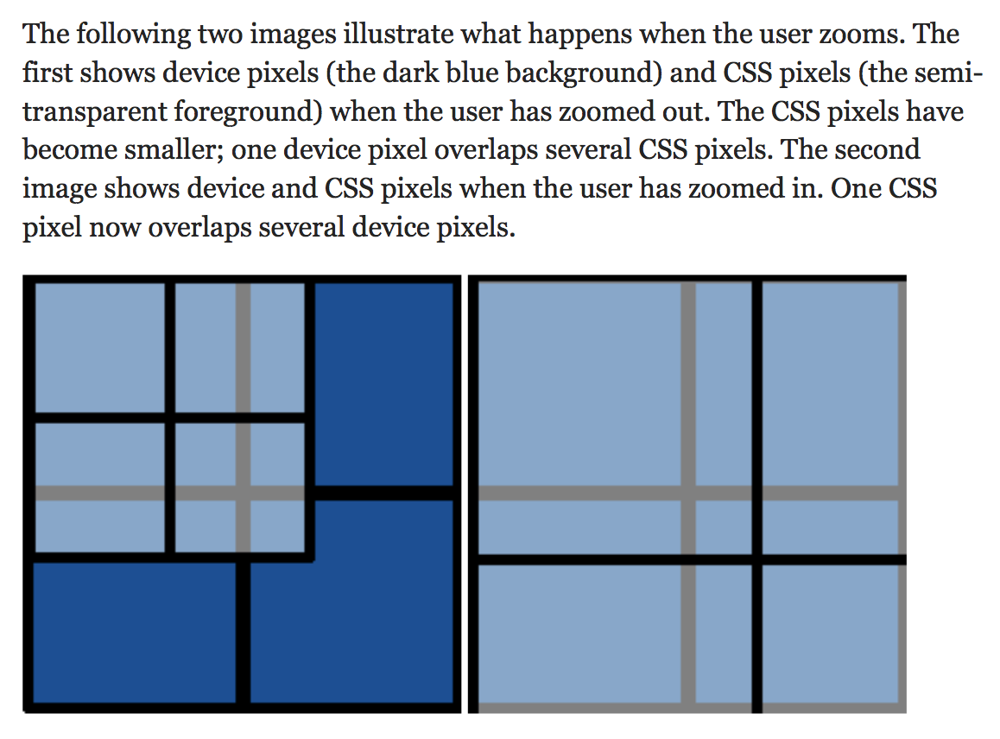

# 移动端

## 移动端适配

https://developers.google.cn/web/fundamentals/design-and-ux/responsive/

### 设置视口

对于针对各种设备优化过的网页，其文档标头中必须包含元视口元素。元视口代码会指示浏览器如何对网页尺寸和缩放比例进行控制。

使用元视口代码控制浏览器视口的宽度和缩放比例。
添加 width=device-width 以便与屏幕宽度css pixels进行匹配。
添加 initial-scale=1 means 1 CSS pixel is equal to 1 viewport pixel. 
确保在不停用用户缩放功能的情况下，您的网页也可以访问。



### dpr

a device pixel ratio of 2 means that there are two hardware pixels for every one CSS pixels.

### 毛豆商城px2rem

动态对html根元素的font-size进行修改，在页面初次加载于window触发resize事件时修改html根元素的font-size

预设：
设计稿统一750px
px2rem的remunit=75px

eleDesignSize:元素在设计稿上的尺寸
eleCssSize:写在css文件中的元素的尺寸，数值与eleDesignSize相等，即：eleCssSize==eleDesignSize
deviceWidth:手机宽度
remunit:px2rem里面设置的rem单位
rootFontSize:html根元素的font-size

eleCssSize/remunit * rootFontSize = deviceWidth/750*eleDesignSize
1/remunit*rootFontSize=deviceWidth/750
rootFontSize=deviceWidth/750*remunit
当remunit==75时，rootFontSize=deviceWidth/10

### flexible.js原理
flexible实际上就是能过JS来动态改写meta标签，代码类似这样：
```js
var metaEl = doc.createElement('meta');
var scale = isRetina ? 0.5:1;
metaEl.setAttribute('name', 'viewport');
metaEl.setAttribute('content', 'initial-scale=' + scale + ', maximum-scale=' + scale + ', minimum-scale=' + scale + ', user-scalable=no');
if (docEl.firstElementChild) {
    document.documentElement.firstElementChild.appendChild(metaEl);
} else {
    var wrap = doc.createElement('div');
    wrap.appendChild(metaEl);
    documen.write(wrap.innerHTML);
}
```
事实上他做了这几样事情：

动态改写\<meta>标签
给\<html>元素添加data-dpr属性，并且动态改写data-dpr的值
给\<html>元素添加font-size属性，并且动态改写font-size的值

## 移动端最小触控区域44*44px